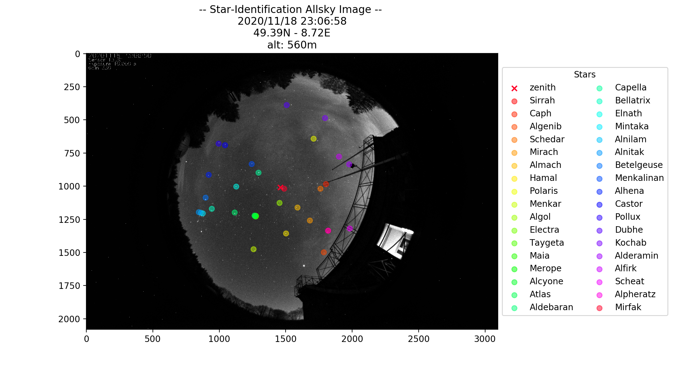
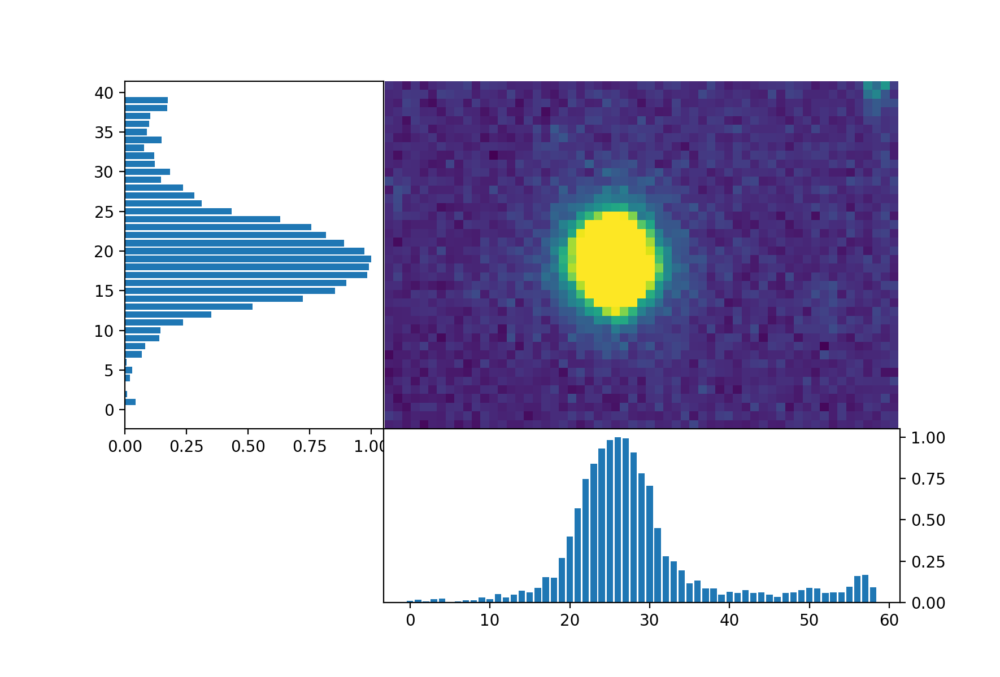
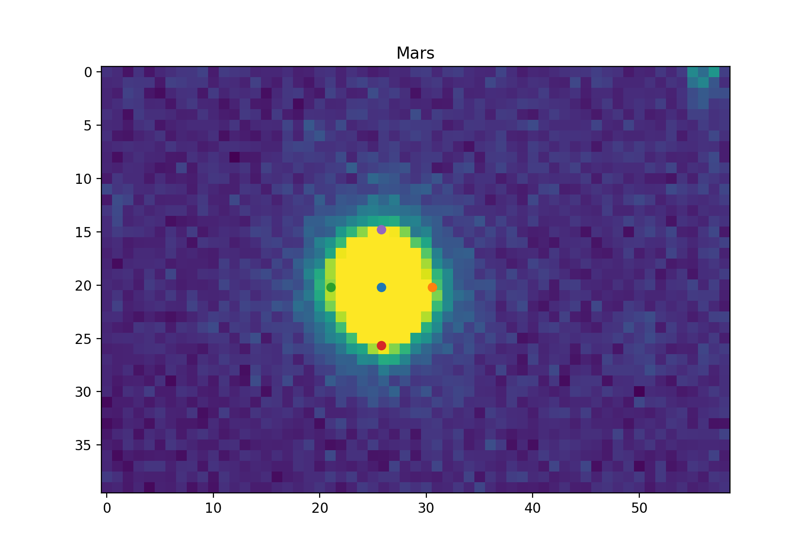
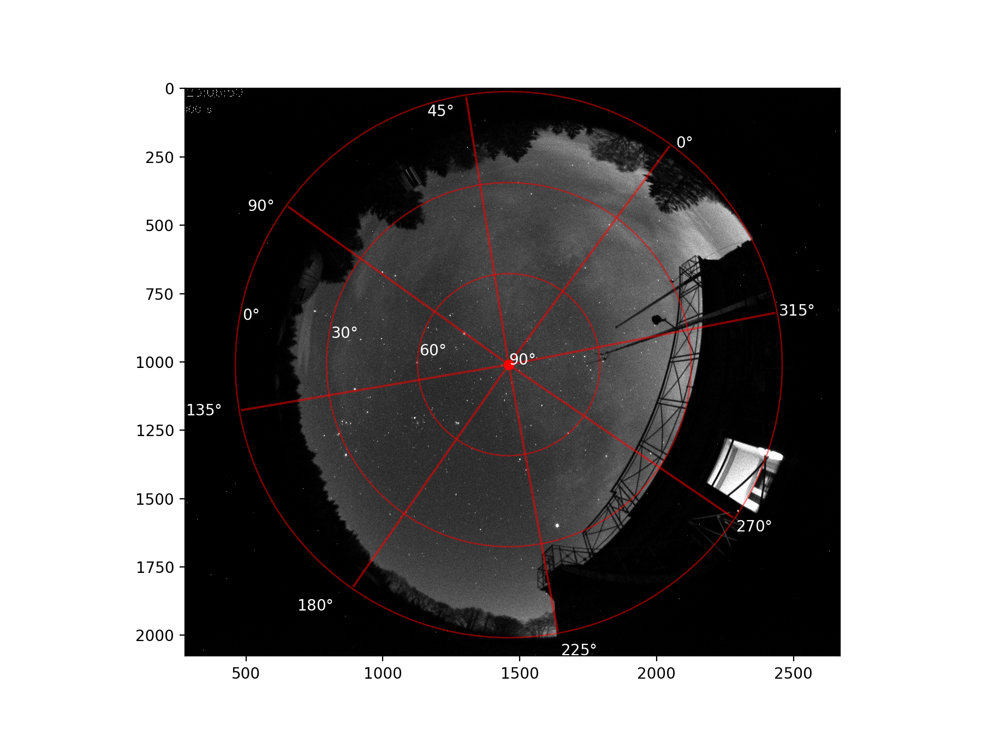

# Allsky-Identifier
### To Identify Stars in an Allsky-image and determine their FWHM

Needs to be adapted depending on the orientation of one camera (images). 
In parameters.py change location and other parameters according to location/requirements. 

Locates the Stars in an Image: 

Then one can plot the row/column - wise distributions of measured counts of the pixels. 
Gaussians will be fitted over this to determine the FWHM and size of the star/object. 

 
 
Optionally can also produce image like this for orientation of night sky. 

